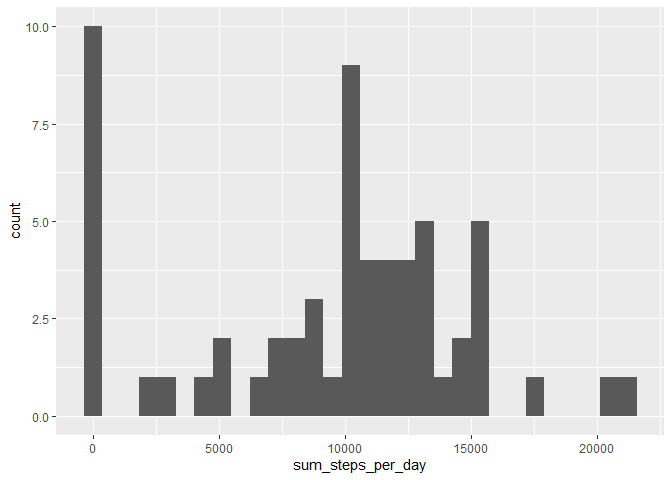
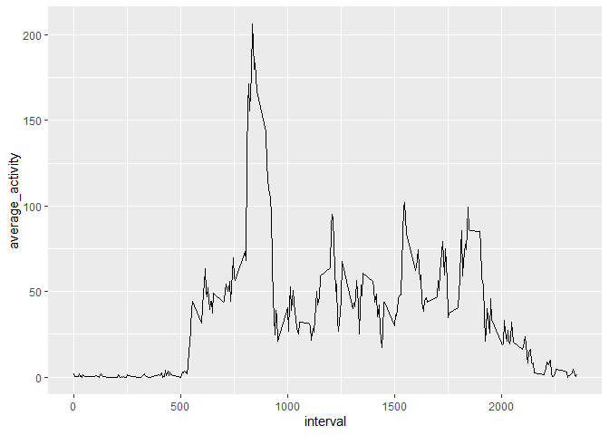
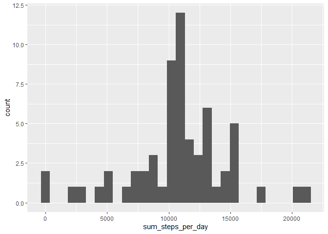

## Loading and preprocessing the data

Loading libraries:


```r
library(readr)
library(ggplot2)
library(dplyr)
```

The following settings are local-environment dependent so they have to be 
adjusted according to the local computer settings.


```r
# Folder with the cloned repository
project_folder = "D:/projects/RepData_PeerAssessment1"
```

Code responsible for unzipping the archive and reading the data:


```r
original_folder = getwd()
setwd(project_folder)

unzip("activity.zip", overwrite = TRUE, exdir = ".")

original_data <- read_delim("activity.csv", 
                           skip = 1,
                           delim = ",",
                           col_names = c("steps", "date", "interval"),
                            col_types = cols(
                              steps = col_integer(),
                              date = col_date(format= "%Y-%m-%d"),
                              interval = col_factor()))

summary(original_data)
```

```
##      steps             date               interval    
##  Min.   :  0.00   Min.   :2012-10-01   0      :   61  
##  1st Qu.:  0.00   1st Qu.:2012-10-16   5      :   61  
##  Median :  0.00   Median :2012-10-31   10     :   61  
##  Mean   : 37.38   Mean   :2012-10-31   15     :   61  
##  3rd Qu.: 12.00   3rd Qu.:2012-11-15   20     :   61  
##  Max.   :806.00   Max.   :2012-11-30   25     :   61  
##  NA's   :2304                          (Other):17202
```


## What is mean total number of steps taken per day?

The histogram for the "total number of steps per day" distribution


```r
total_steps_per_day <- original_data %>% select(steps, date) %>% 
                      group_by(date) %>%
                      summarise(sum_steps_per_day = sum(steps, na.rm = TRUE)) 
```

```
## `summarise()` ungrouping output (override with `.groups` argument)
```

```r
ggplot(data = total_steps_per_day, aes(x = sum_steps_per_day)) + 
      geom_histogram(bins = 30)
```

<!-- -->


Calculating the mean and the median of the total number of steps taken per day:


```r
mean_median_total_steps <- total_steps_per_day %>%
  summarize(mean = mean(sum_steps_per_day), median = median(sum_steps_per_day))
mean_median_total_steps
```

```
## # A tibble: 1 x 2
##    mean median
##   <dbl>  <int>
## 1 9354.  10395
```

The mean of the total number of steps per day is 9354.2295082
and the median -  10395.

## What is the average daily activity pattern?


```r
mean_day_activities <- original_data %>% group_by(interval) %>%
                       summarize(average_activity = mean(steps, na.rm = TRUE)) %>%
                       mutate(interval = as.numeric(as.character(interval))) %>%
                       arrange(interval)
```

```
## `summarise()` ungrouping output (override with `.groups` argument)
```

```r
ggplot(mean_day_activities, aes(x=interval, y=average_activity)) +
geom_line()
```

<!-- -->


The interval 835  contains on the 
average the biggest number of steps done throughout the day.


## Imputing missing values


```r
number_rows_with_na <- sum(is.na(original_data$steps) | is.na(original_data$date) | is.na(original_data$interval))
```

There are 2304 rows with missing data in the original dataset.
The propose imputing strategy is to use the mean number of steps form the specified interval from all days. 

The imputed data is stored in the original_imputed_data. 

```r
original_imputed_data <- original_data %>%
                         mutate(interval = as.integer(as.character(interval))) %>%
                         mutate(steps = as.double(steps))
original_imputed_data <- left_join(original_imputed_data, mean_day_activities, by="interval")

original_imputed_data <- original_imputed_data %>% 
                         mutate(steps = ifelse(is.na(steps), average_activity, 
                                               steps)) %>%
                         select(-average_activity)
```

The new histogram of the total steps per day is as it follows:


```r
total_imputed_steps_per_day <- original_imputed_data %>% select(steps, date) %>% 
                      group_by(date) %>%
                      summarise(sum_steps_per_day = sum(steps, na.rm = TRUE)) 
```

```
## `summarise()` ungrouping output (override with `.groups` argument)
```

```r
ggplot(data = total_imputed_steps_per_day, aes(x = sum_steps_per_day)) + 
      geom_histogram(bins = 30)
```

<!-- -->

Computing the mean / median of total steps per day: 


```r
mean_median_total_steps_imputed <- total_imputed_steps_per_day %>%
  summarize(mean = mean(sum_steps_per_day), median = median(sum_steps_per_day))
mean_median_total_steps_imputed
```

```
## # A tibble: 1 x 2
##     mean median
##    <dbl>  <dbl>
## 1 10766. 10766.
```


The mean of the total number of steps per day is 10766.19
and the median -  10766.19 (all values are rounded). After data imputing
those values are naturally higher. 

## Are there differences in activity patterns between weekdays and weekends?
